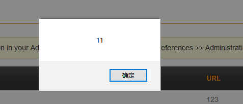

# cmsms_vul
## XSS-1
When modifying the email, if the format is wrong, the response contains the previously entered email value. At this time, the XSS vulnerability will be started.   
 
 

## XSS-2
When creating Shortcuts, the system does not detect the Title, which will cause a storage XSS vulnerability. 
 
The value of inputting is 
```
"></script><script>alert(11)</script>
```

